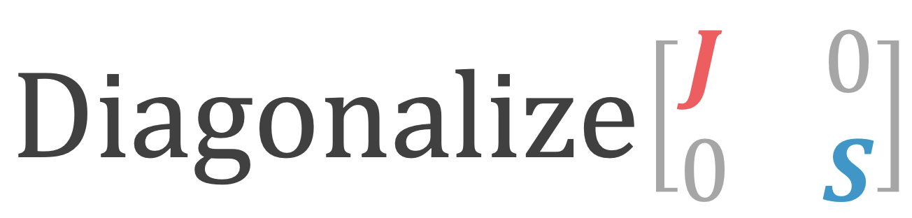

## About
This is a simple JavaScript Library for computing eigenvalues, eigenvectors for real symmetric matrix. Uses Jacobi method to perform diagonalization.
## Working Demo (uses webworker for parallel computation)
Check this Demo to see for yourself!

## Using single threaded Library
Note : If you are using this in your app, the browser might freeze if the matrix size is too big (N>25). 
```html
<script type="text/javascript" src="jacobi.js"></script>
```
Use multi-threaded version instead for N>25, code is in <i>jacobi_worker.js</i>. See the <i>index.html</i>  and <i>main.js</i> for implementing the multithreaded version. 

## Basic Usage 
```javascript
Hij = [[0.2,0.1],[0.1,1.1]] 
Out = diag(Hij)
E = Out[0];
U = Out[1];
```
# Slighly "Advanced" Usage 
```javascript
Hij = [[0.2,0.1],[0.1,1.1]] 
\\ sencond parameter is for numerical precision 
Out = diag(Hij,1E-16) 
E = Out[0]; \\ energies sorting from low to high
U = Out[1]; \\ corresponding wavefunction | U[:][0] is the ground state wavefunction
\\ you can reduce the sencond parameter to reduce accuracy but get results faster
Out = diag(Hij,1E-4) 
E = Out[0];
U = Out[1];
```


---
Arkajit Mandal
University of Rochester